# Namma Omni AI 🛣️⚡🌤️

A poly-agent platform that ingests real-time city signals (traffic flow, power-grid status, weather, citizen reports), lets domain-specific LLM agents reason over them, and streams structured insights to a Next.js dashboard.

* Front-end – Next 15 + Tailwind + Radix UI  
* API / Streaming gateway – Go 1.22 + Connect-gRPC + Firestore  
* Worker agents – Python 3.11, LangChain-style orchestration, deployed as Cloud Functions / Cloud Run  
* Messaging – GCP Pub/Sub (fan-out router + LLM summariser)  
* IaC – Terraform

---

## Table of Contents
1. Features
2. Repository Layout
3. High-Level Architecture
4. Development Guide
5. Deployment Guide
6. ADR Index
7. Contributing & Coding Standards
8. License

---

## 1  Features
• Live traffic congestion digests with delay estimates  
• Power-grid outage timeline & severity analytics  
• AI-generated multi-domain summary (Gemini 2.5 Pro)  
• Citizen pothole reporting API (Geotagged)  
• Reactive dashboard with streaming updates (no polling)  

---

## 2  Repository Layout
```
NammaOmniAI/
├─ agents/                       # Python orchestration stacks
│  ├─ energy-management-orchestrator/
│  └─ traffic-update-orchestrator/
│     └─ sub_agents/{bbmp,btp,…}
├─ backend/                      # Go API + gRPC definitions
│  ├─ cmd/                       # main gRPC/REST gateway
│  ├─ internal/                  # Pub/Sub router, summariser
│  ├─ gen/                       # `buf` generated stubs (Connect)
│  ├─ db/                        # Firestore DAL
│  └─ server/                    # lightweight HTTP REST sample
├─ app/                          # Next.js 15 source (app-router)
├─ components/                   # Reusable React comp.
├─ hooks/                        # Custom React hooks (gRPC streams)
├─ terraform/                    # IaC for Cloud Run, Pub/Sub, etc.
└─ docs/
   ├─ adr/                       # Architecture Decision Records
   └─ feature-specs/
```

---

## 3  High-Level Architecture

```mermaid
sequenceDiagram
    autonumber
    actor User
    participant Frontend as Webpage
    participant gRPC as gRPC Server
    participant PubSub as Pub/Sub
    participant EMAgent as EnergyManagementAgent (Cloud Run)
    participant TAgent as TrafficUpdateAgent (Cloud Run)
    participant Vertex as Vertex AI (Gemini)
    participant Backend as Backend

    User->>Frontend: Load webpage
    Frontend->>gRPC: StreamSummary(lat/long/5km)
    Frontend->>gRPC: EnergyManagementEventsService(lat/long/5km)
    Frontend->>gRPC: TrafficUpdateEventsService(lat/long/5km)

    gRPC->>PubSub: publish trigger-energy-management-agent
    gRPC->>PubSub: publish trigger-traffic-update-agent

    PubSub-->>EMAgent: trigger-energy-management-agent
    PubSub-->>TAgent: trigger-traffic-update-agent

    EMAgent->>Vertex: Gemini query social media / news / web with lat/long/areas
    TAgent->>Vertex: Gemini query social media / news / web with lat/long/areas

    Vertex-->>EMAgent: energy data
    Vertex-->>TAgent: traffic data

    EMAgent->>PubSub: publish energydata
    TAgent->>PubSub: publish trafficupdate

    PubSub-->>gRPC: deliver energydata
    PubSub-->>gRPC: deliver trafficupdate

    gRPC->>Vertex: Gemini summarize energydata & trafficupdate
    Vertex-->>gRPC: AI summary

    gRPC->>Frontend: AI summary

    Note over PubSub,gRPC: Live‑feed topics

    PubSub-->>gRPC: deliver energydata (live)
    PubSub-->>gRPC: deliver trafficupdate (live)

    gRPC->>Frontend: Live feeds

```



Key points:
1. Browser speaks _Connect-JSON_ which de-grades to standard fetch—no gRPC-web runtime needed.
2. `internal/pubsub_router.go` multiplexes a **single** subscription to N listeners, avoiding duplicate Pub/Sub pull loops.
3. Summariser currently pass-through; can be switched to `internal.NewSummarizerGemini` once LLM costs approved.
4. Agents are event-driven Cloud Functions; they hydrate topic-specific JSON payloads consumed by the dashboard hooks.

---

## 4  Development Guide

### 4.1 Prerequisites
• Node ≥ 18 / PNPM  
• Go ≥ 1.22  
• Python ≥ 3.11 + `poetry` or `pipx`  
• Docker + `gcloud` CLI (for emulators & Cloud Run)  
• jq (scripts)  

### 4.2 Environment Variables
```
GCP_PROJECT_ID=namma-omni-dev
GEMINI_API_KEY=<see makersuite.google.com>
NEXT_PUBLIC_GRPC_HOST=http://localhost:8080   # optional
```

### 4.3 Front-end
```bash
cd app
pnpm install
pnpm dev          # http://localhost:3000
```

### 4.4 Go Gateway
```bash
cd backend
go mod download
go run ./cmd      # listens :8080 (HTTP/2 h2c)
```

### 4.5 Python Agents
```bash
cd agents/traffic-update-orchestrator
pip install -r requirements.txt
python -m agents.traffic-update-orchestrator.main
# repeat for energy-management-orchestrator
```

### 4.6 Local Cloud SDK Emulators (optional)
```bash
# Firestore + Pub/Sub
gcloud beta emulators firestore start --host-port=localhost:8900 &
gcloud beta emulators pubsub start    --host-port=localhost:8901 &
export FIRESTORE_EMULATOR_HOST=localhost:8900
export PUBSUB_EMULATOR_HOST=localhost:8901
```

### 4.7 Tests
*Go* – `go test ./...`  
*Python* – `pytest agents/**/tests`  
*Lint* – `golangci-lint run`, `pnpm lint`  

---

## 5  Deployment Guide

### 5.1 CI/CD Overview
1. Push to `main` triggers GitHub Actions:
   * Build docker images for `backend/cmd` and each agent
   * Push to Artifact Registry
   * `terraform plan` (dry-run)
2. Manual **“Deploy”** job applies Terraform.

### 5.2 Terraform
```bash
cd terraform
terraform init
terraform apply          # creates Cloud Run, Pub/Sub, Firestore, IAM
```

### 5.3 Container Images
```
docker build -t us-docker.pkg.dev/$GCP_PROJECT_ID/omni/backend:$(git rev-parse --short HEAD) -f backend/Dockerfile .
docker push us-docker.pkg.dev/$GCP_PROJECT_ID/omni/backend:...
```
Terraform picks latest tags via variables.

### 5.4 Front-End Hosting
Option A – Vercel (zero-config, set `NEXT_PUBLIC_GRPC_HOST`)  
Option B – Cloud Run (static export)  
```bash
pnpm build && pnpm next export
gcloud run deploy omni-ui --source=./out --allow-unauthenticated
```

### 5.5 Smoke Tests
```bash
curl -N http://<cloudrun-url>/summary.v1.SummaryService/StreamSummary \
  -H 'Content-Type: application/connect+json' --data-binary $'.....'
```

---

## 6  ADR Index

| #  | Title | Status |
|----|-------------------------------|---------|
| 001 | Monorepo over Polyrepo | Accepted |
| 002 | Connect-gRPC vs REST | Accepted |
| 003 | Firestore as primary DB | Accepted |
| 004 | Pub/Sub for intra-service events | Accepted |
| 005 | Cloud Run over Kubernetes | Proposed |
| 006 | Gemini 2.5-Pro for summarisation | Proposed |

> Detailed markdown files live in `docs/adr/00X-*.md`.  
> Generate new records with `npx adr-log new "<title>"`.

---

## 7  Contributing & Coding Standards
1. Follow Go FMT & `goimports`; run `make fmt` before commits.  
2. 🍃  Use conventional commits `feat:`, `fix:`, `docs:` to unlock auto-changelog.  
3. Keep ADRs up-to-date when architecture deviates.  
4. All new gRPC APIs must have proto + Connect stubs regenerated via `buf generate`.  

---

## 8  License
MIT © 2024 – Namma Omni Contributors

---

Happy hacking 🎉